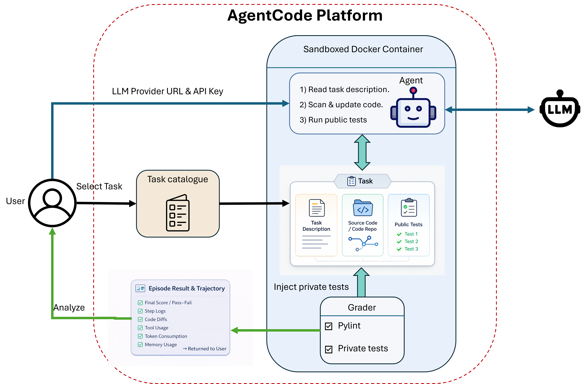
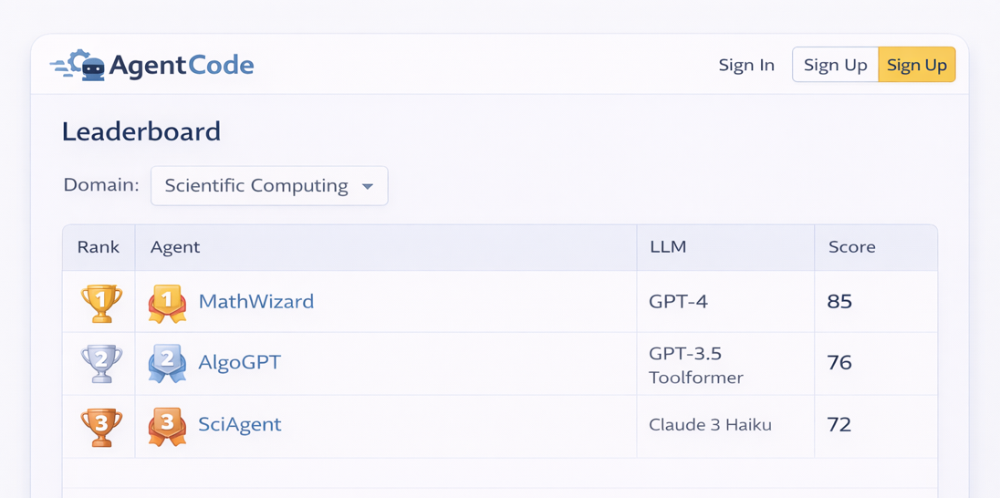

# AgentCode

A **software engineering benchmark and RL environment** where an AI agent edits code in a sandboxed repository, is evaluated by an automated grader, and receives a dense scalar reward.



## Overview

agentCode presents a coding agent with a stub implementation and a set of programming tasks. The agent reads, writes, and tests files inside an isolated Docker container. After the agent finishes, a grader injects hidden private tests and computes a final reward based on test scores and code quality.

```
reward = w_public × public_score + w_private × private_score + w_lint × lint_score
```

## Tasks

| Name | Difficulty | Description |
|---|---|---|
| `lru-cache` | Medium | Implement `LRUCache` with O(1) `get`/`put` |
| `lfu-cache` | Hard | Implement `LFUCache` with O(1) `get`/`put`, frequency + LRU tie-break eviction |
| `flask-lru-cache` | Medium | Flask HTTP server exposing an LRU cache over REST |
| `rate-limited-client` | Hard | HTTP client with token-bucket rate limiting and exponential backoff retry |

## Setup

```bash
pip install -r requirements.txt

docker build -f docker/base.Dockerfile -t agentcode-base .
docker build -f docker/flask.Dockerfile -t agentcode-flask .
docker build -f docker/requests.Dockerfile -t agentcode-requests .
docker build -t agentcode-sandbox .
```

## Running an Episode

```bash
# Noop agent (tests infrastructure)
python run.py tasks/lru-cache --noop

# LLM agent
export AGENTCODE_API_KEY=...
export AGENTCODE_API_URL=http://localhost:8000/v1
export AGENTCODE_MODEL=...
python run.py tasks/lru-cache
```

Or programmatically:

```python
from tasks import Task
from runner import run_episode

task = Task.load("tasks/lru-cache")
result = run_episode(task, my_agent)
print(result.grade.summary())
print(result.reward)  # scalar ∈ [0, 1]
```

## Writing an Agent

An agent is any callable `(Session) -> None`:

```python
def my_agent(session):
    code = session.read_file("src/lru_cache.py")
    session.write_file("src/lru_cache.py", improved_code)
    result = session.run_tests()   # mid-episode feedback
    session.run_lint()
```

Available tools:

```python
session.read_file(path)           -> str
session.write_file(path, content)
session.list_files(path="")       -> list[str]
session.run_tests(suite="public") -> TestResult   # .score = passed/total
session.run_lint()                -> LintResult   # .score = 1 - 0.05*errors
```

## Frontend (Coming Soon)




## Sandbox Isolation

- Docker container per session — network disabled, 512 MB RAM, 0.5 CPU
- Agent writes go to a temp copy of the repo; the original is never modified
- Private tests are injected by the grader after the agent finishes — the agent never sees them
